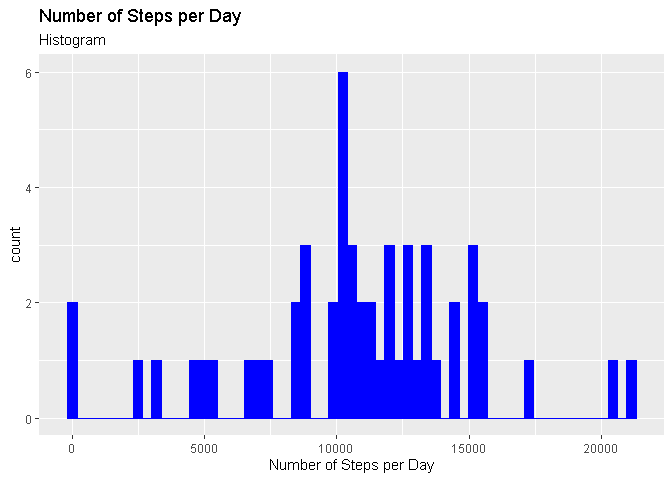
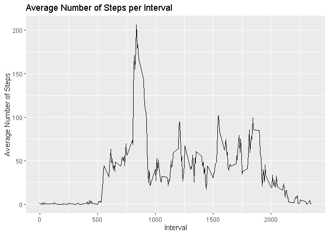
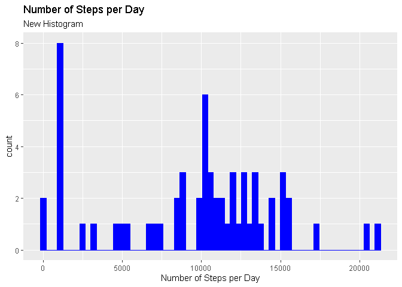
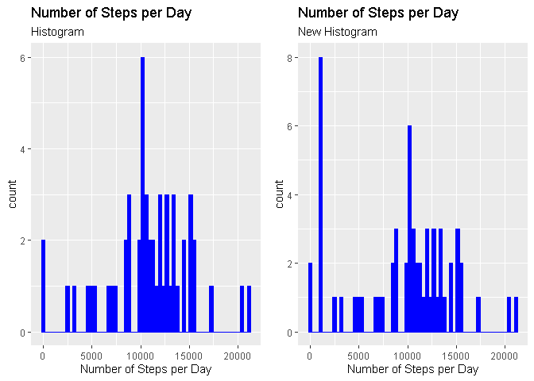
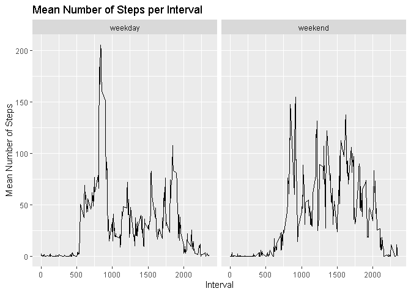

## Loading and preprocessing the data

```r
library(tidyverse)
library(lubridate)
library(gridExtra)

unzip("activity.zip")
data <- read.csv("activity.csv", header = TRUE, sep = ",")

data$date <- ymd(data$date)
```


## What is mean total number of steps taken per day?
1.

```r
nspd <- data %>% group_by(date) %>% summarize(number.of.steps = sum(steps))
```
2.

```r
g <- ggplot(nspd, aes(number.of.steps)) + 
        geom_histogram(na.rm = TRUE, color = "blue", fill = "blue", bins = 61) +
        labs(title = "Number of Steps per Day", subtitle = "Histogram", 
             x = "Number of Steps per Day")
print(g)
```

<!-- -->
3.

```r
mean.nspd <- mean(nspd$number.of.steps, na.rm = TRUE)
median.nspd <- median(nspd$number.of.steps, na.rm = TRUE)
```
The mean of the total number of steps per day is: 1.0766189\times 10^{4}  
The median of the total number of steps per day is: 10765

```r
rm(nspd)
```

## What is the average daily activity pattern?
1.

```r
mspi <- data %>% group_by(interval) %>% 
                         summarize(average = mean(steps, na.rm = TRUE))
ggplot(mspi, aes(interval, average)) + geom_line() +
        labs(title = "Average Number of Steps per Interval", 
             x = "Interval", y = "Average Number of Steps")
```

<!-- -->
2.

```r
max <- mspi$interval[which.max(mspi$average)]
```
The 5-minute interval with the maximum number of steps, on average, is: 835

```r
rm(mspi, max)
```

## Imputing missing values
1.

```r
nas <- sum(is.na(data$steps))
```
The total number of rows with missing data is: 2304  
  
2. The missing values will be replaced by the median value of the day, if it exists. If not, they
will be replaced by the median value of the interval. The strategy assumes that the movement of the 
subject tends to be same throughout the day, with some outliers, and without a day-to-day routine.  
  
3.

```r
mespd <- data %>% group_by(date) %>% summarize(median = median(steps, na.rm = TRUE))
mespi <- data %>% group_by(interval) %>% summarize(median = median(steps, na.rm = TRUE))

newdata <- as_tibble(data)

for (i in 1:length(newdata$steps)) {
        if (is.na(newdata$steps[i])) {
                newdata$steps[i] <- mespd$median[which(mespd$date == newdata$date[i])]
        }
}
for (i in 1:length(newdata$steps)) {
        if (is.na(newdata$steps[i])) {
                newdata$steps[i] <- mespi$median[which(mespi$interval == newdata$interval[i])]
        }
}
```


```r
rm(mespi, mespd)
```
4.

```r
nspd2 <- newdata %>% group_by(date) %>% summarize(number.of.steps = sum(steps))
g2 <- ggplot(nspd2, aes(number.of.steps)) + 
        geom_histogram(na.rm = TRUE, color = "blue", fill = "blue", bins = 61) +
        labs(title = "Number of Steps per Day", subtitle = "New Histogram", 
             x = "Number of Steps per Day")
print(g2)
```

<!-- -->

```r
mean2.nspd <- mean(nspd2$number.of.steps, na.rm = TRUE)
median2.nspd <- median(nspd2$number.of.steps, na.rm = TRUE)
```
The new mean of the total number of steps per day is: 9503.8688525  
The new median of the total number of steps per day is: 1.0395\times 10^{4}

```r
grid.arrange(g, g2, ncol = 2)
```

<!-- -->

```r
mean.pc <- (mean2.nspd - mean.nspd)/mean.nspd
median.pc <- (median2.nspd - median.nspd)/median.nspd
```
The percent change of the mean is: -11.7248533%  
The percent change of the median is: -3.4370646%  
  
The imputing of the missing data drifted the data towards a more sedentary movement of the subject. 
The median value of the day tended to be low, so the new total number of steps per day decreased in 
the days with missing values.

```r
rm(nas, nspd2, mean.nspd, median.nspd, mean2.nspd, median2.nspd, mean.pc, median.pc, g, g2)
```
## Are there differences in activity patterns between weekdays and weekends?
1.

```r
wd <- wday(newdata$date, label = TRUE)
week.day <- vector(length = length(wd))
for (i in 1:length(wd)) {
  if (wd[i] == "Sun" | wd[i] == "Sat") {
    week.day[i] <- "weekend"
  }
  else{
    week.day[i] <- "weekday"
  }
}
week.day <- factor(week.day)
newdata <- mutate(newdata, week.day)
```

```r
rm(i, wd, week.day)
```
2.

```r
s.newdata <- group_by(newdata, interval, week.day) %>% summarize(mean.steps = mean(steps))
g3 <- ggplot(s.newdata, aes(interval, mean.steps)) + geom_line() + facet_grid(cols = vars(week.day)) + 
  labs(title = "Mean Number of Steps per Interval", x = "Interval", y = "Mean Number of Steps")
print(g3)
```

<!-- -->

```r
rm(data, newdata, s.newdata, g3)
```
